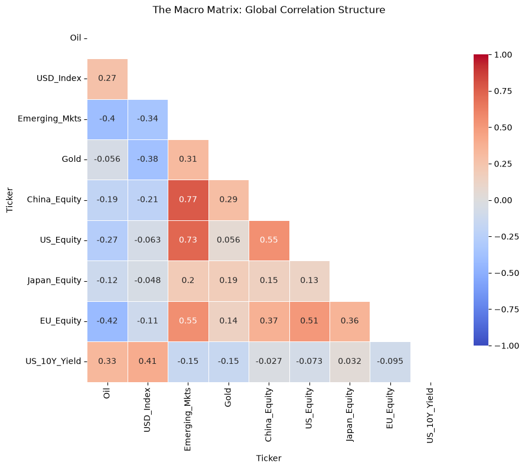
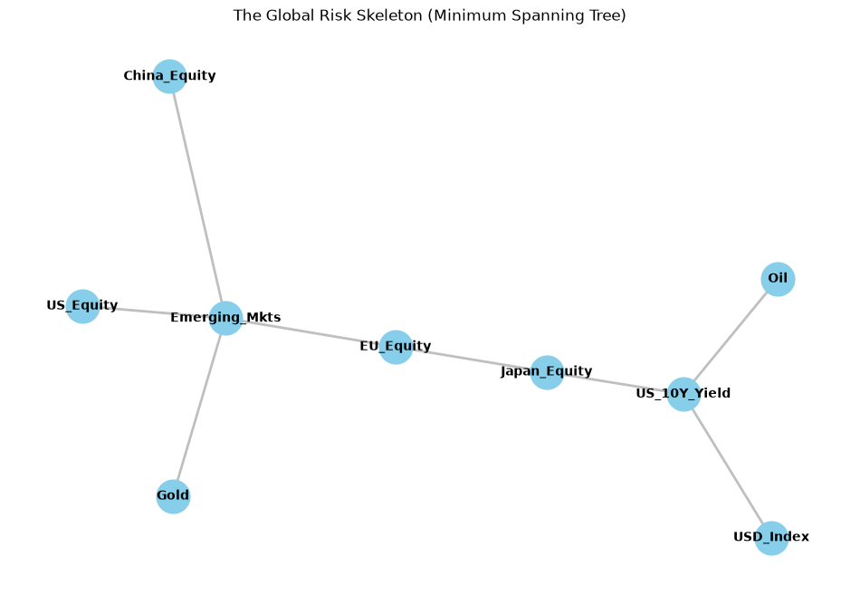
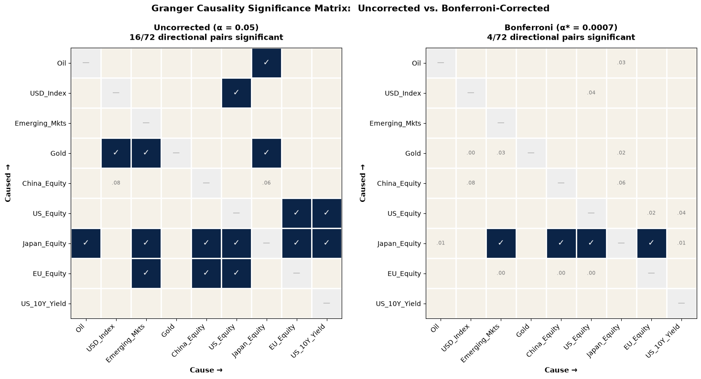
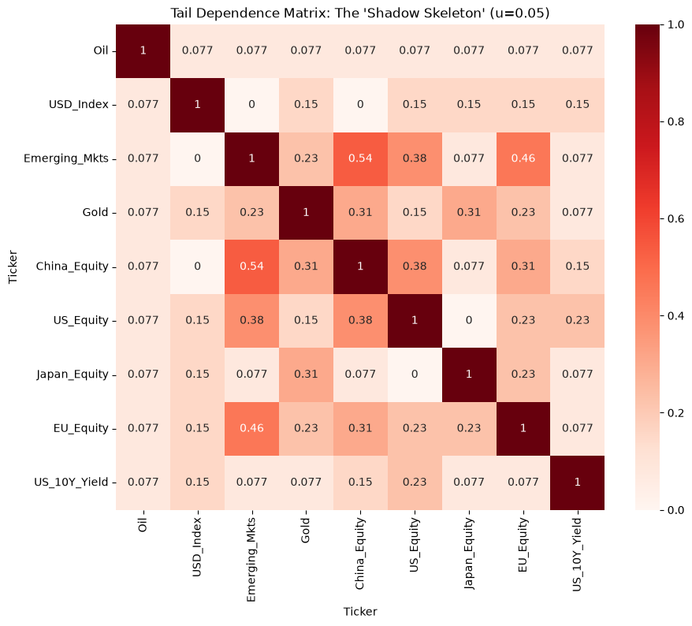
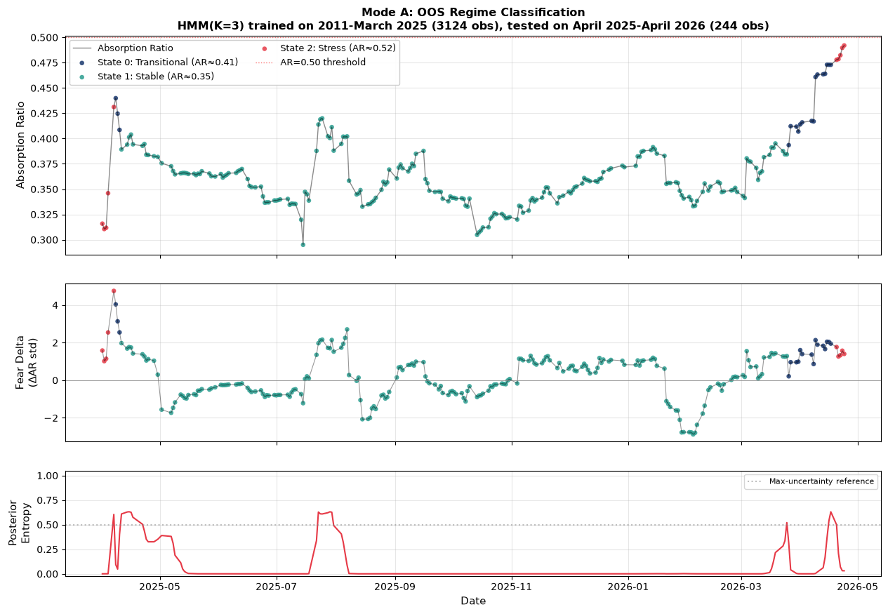
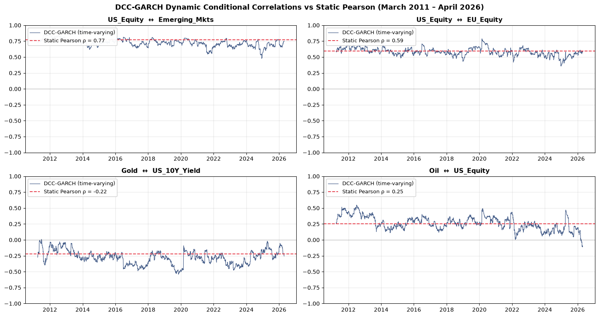

# The Geometry of Risk

### An Integrated Monitoring Framework for Multi-Asset Systemic Stress

[](https://opensource.org/licenses/MIT)
[](https://www.python.org/downloads/)

This repository contains the complete code and data pipeline for the Geometry of
Risk research project: a four-layer empirical monitoring framework for multi-asset
systemic stress diagnostics.

The framework is positioned within the empirical systemic-risk monitoring
tradition of Kritzman et al. (2011) and Diebold and Yilmaz (2014). It is not a
structural equilibrium asset-pricing model, a forecasting system, or an attempt
to derive prices from first principles. The statistical objects produced—
correlation distances, minimum spanning trees, principal components, Granger
predictability matrices, and HMM latent states—are descriptive characterisations
of the empirical joint distribution of returns.

## Key results

- **The Absorption Ratio breaches Kritzman et al.'s (2011) 0.50 threshold in
  all four episodes tested.** Peaks: GFC 0.537 (on 10.5% of days), COVID 0.601
  (5.5%), Fed tightening 0.529 (8.3%), and the current study 0.507 (1.4%). The
  current-study breach is brief and marginal: 3 days at the very end of the
  window.
- **The out-of-sample HMM flags stress only when it happened.** Trained on
  2011 to March 2025 only, it labels 4.1% of the following year as stress (the
  training base rate was 25.6%), in exactly two episodes: 1–7 April 2025 (the
  tariff shock) and 20–24 April 2026 (the end-of-sample peak). Posterior
  entropy averages 0.07.
- **Every Bonferroni-surviving Granger link points into Japan.** Of 72
  directional pairs, 4 survive α* = 0.0007: US, EU, China and emerging-market
  equity each lead Japanese equity.
- **Two independent methods partly agree on market structure.** The
  correlation-network tree and a parametric DCC-GARCH tree share 5 of 8 links
  (Jaccard = 0.455).
- **Oil is quasi-exogenous.** Joint F-tests don't reject in either direction
  (p = 0.38 and 0.33), yet oil explains 11–16% of the 10-day forecast-error
  variance of EU equity, emerging markets and the US 10-year yield.

## Visual tour

| | |
|---|---|
|  **Correlation structure.** The current-study window, 9 assets. |  **Risk skeleton (MST).** The shortest set of links connecting all 9 assets by correlation distance. |
|  **Granger causality**, uncorrected vs Bonferroni. Only links into Japan survive. |  **Lower-tail dependence.** Which assets fall together in the worst 5% of days. |


*Absorption Ratio across four stress episodes. Shaded: days above the 0.50 threshold.*


*The out-of-sample HMM on April 2025 – April 2026, trained only on earlier data. Red: stress
state. Bottom panel: posterior entropy (model uncertainty).*

<details><summary>DCC-GARCH dynamic vs static correlations</summary>


</details>

## Live dashboard

A running instance of the framework's core layer (Rolling Absorption Ratio,
the standardised AR delta, HMM regime state, and the current correlation
matrix) is live at
[youness-yachruti.pages.dev/quantitative-finance/geometry-of-risk](https://youness-yachruti.pages.dev/quantitative-finance/geometry-of-risk/),
updated daily. It intentionally diverges from this repository's methodology
in one way: the HMM there is refit fresh on every update rather than using
the single, out-of-sample-validated model described below — see
`scripts/compute_risk_dashboard.py` and the dashboard page itself for the
full explanation. For the peer-reviewed, fixed-model analysis, use this
repository and `notebooks/geometry_of_risk.ipynb`.

## Overview

The framework integrates four methodological layers applied to nine globally
representative asset classes (US, EU, Japan, China, and Emerging Markets
equity; Gold; the US Dollar Index; Brent crude oil; and the US 10-Year Treasury
Yield):

| Layer | Methods |
|---|---|
| **1. Network topology** | Correlation distance, Multidimensional Scaling, Ward hierarchical clustering, Minimum Spanning Trees (price-based and volume-weighted) |
| **2. Dynamic causality** | Pairwise Granger causality with Bonferroni correction, lead-lag cross-correlation, joint F-tests for asset exogeneity, variance decomposition |
| **3. Tail-risk quantification** | Conditional Value-at-Risk, lower tail dependence, MOVE/VIX sensitivities with Newey–West standard errors |
| **4. Regime classification** | Rolling Absorption Ratio, Hidden Markov Model with BIC selection, posterior entropy, out-of-sample evaluation on multi-crisis training history |

**Sample windows:**
- Current-study analytical core: April 2025 to 24 April 2026 (N = 261)
- Long-history validation sample: 31 March 2011 to 24 April 2026 (N = 3,472)

**Robustness components:**
1. Multi-crisis Absorption Ratio replication across the 2007–2009 GFC, the
   2019–2020 COVID-19 dislocation, the 2022–2023 Federal Reserve tightening cycle,
   and the current-study window — all four episodes breach the Kritzman et al.
   (2011) 0.50 threshold
2. Dynamic Conditional Correlation GARCH baseline (Engle, 2002) on the
   long-history sample, providing a parametric benchmark for the network-
   topological approach (MST Jaccard similarity = 0.455)
3. Out-of-sample HMM evaluation calibrated on the 14-year multi-crisis training
   history, correctly identifying the April 2026 stress regime with bounded
   posterior entropy

## Repository structure

```
geometry-of-risk/
├── README.md                        This file
├── LICENSE                          MIT License (code)
├── requirements.txt                 Python dependencies
├── notebooks/
│   └── geometry_of_risk.ipynb       Main reproducible notebook
├── data/
│   ├── asset_prices_long_history.csv  Long-history closes, 2007 – 24 Apr 2026
│   └── snapshot/                      Frozen current-study window (prices, volumes, VIX, MOVE, FRED)
├── figures/                         README charts, exported from the notebook
├── scripts/
│   ├── fetch_snapshot.py            Rebuilds data/snapshot/ (the manuscript window)
│   ├── fetch_data.py                Optional: refresh the long-history CSV
│   ├── export_figures.py            Copies the notebook's charts into figures/
│   └── compute_risk_dashboard.py    Daily data for the live dashboard
└── manuscript/
    └── README.md                    Pointer to the working paper
```

## Getting started

### Prerequisites

- Python 3.10 or higher
- Approximately 500 MB of disk space (mostly for libraries)
- Internet access (only for first-time setup or fresh-data option)

### Installation

```bash
# Clone the repository
git clone https://github.com/youness-yach/geometry-of-risk.git
cd geometry-of-risk

# Create a virtual environment (recommended)
python -m venv venv
source venv/bin/activate  # Windows: venv\Scripts\activate

# Install dependencies
pip install -r requirements.txt
```

### Two ways to run the analysis

#### Option 1 — Reproduce the manuscript results exactly

Everything the notebook reads is committed. `data/snapshot/` holds the
current-study window (24 April 2025 – 24 April 2026, 261 trading days), and
`data/asset_prices_long_history.csv` the long history. Nothing is downloaded,
so results are the same on every run (about 40 seconds).

```bash
jupyter nbconvert --to notebook --execute --inplace notebooks/geometry_of_risk.ipynb
```

#### Option 2 — Run with fresh data

Pull a current copy of the data from Yahoo Finance:

```bash
python scripts/fetch_data.py
jupyter notebook notebooks/geometry_of_risk.ipynb
```

This overwrites the long-history CSV with current data, and results will then
differ from the manuscript. `scripts/fetch_snapshot.py` rebuilds the frozen
current-study window, and the [live dashboard](https://youness-yachruti.pages.dev/quantitative-finance/geometry-of-risk/)
shows the framework on today's data.

## Reproducibility notes

- **Frozen inputs (September 2026).** The current-study sections originally
  called `yf.download(period="1y")`, so every run pulled a different trailing
  year. The previously saved outputs came from a late-May 2026 download, not
  the manuscript window. Those calls now read `data/snapshot/` through
  `snapshot_download()`, with the same arguments and return shape. After the
  re-run, the headline findings are unchanged: the Absorption Ratio in all four
  episodes, the four Bonferroni links into Japan, DCC-GARCH, the MST Jaccard
  score, and the out-of-sample HMM. Descriptive figures moved slightly (for
  example, oil's F-test p-values went from 0.77/0.25 to 0.38/0.33), and the
  text quotes the re-run values.
- **Fresh-clone fixes.** The long-history CSV path now points to `data/`.
  `statsmodels` is pinned below 0.15, which removed an argument the Granger
  code uses. `plotly` was added to `requirements.txt`. Verified by a clean
  install and a full run.
- All random seeds are set to `42` throughout the analysis.
- Sample-specific results (correlations, MST topology, HMM states) may differ
  slightly across yfinance API versions or if data is pulled on different dates.
- The DCC-GARCH parameter estimation depends on numerical optimisation and may
  produce parameters that differ at the 4th decimal place across runs.

## Citation

If you use this code or methodology, please cite:

> Yachruti, Y. (2026). The Geometry of Risk: An Integrated Monitoring Framework
> for Multi-Asset Systemic Stress. *Working paper.* Available at
> https://github.com/youness-yach/geometry-of-risk

## License

**Code:** MIT License — see [LICENSE](LICENSE).

**Data:** The bundled CSV is derived from Yahoo Finance public data. Users are
responsible for compliance with Yahoo Finance's terms of service.

**Manuscript:** The accompanying working paper is currently under peer review;
reuse of the manuscript text is subject to the journal's eventual license
terms.

## Contact

Youness Yachruti — yyachruti@gmail.com · [LinkedIn](https://www.linkedin.com/in/youness-yachruti/)

## References

The full reference list is provided in the accompanying manuscript. Key
foundational references include:

- Kritzman, M., Li, Y., Page, S., & Rigobon, R. (2011). Principal components as
  a measure of systemic risk. *Journal of Portfolio Management*, 37(4), 112–126.
- Engle, R. F. (2002). Dynamic conditional correlation. *Journal of Business
  and Economic Statistics*, 20(3), 339–350.
- Mantegna, R. N. (1999). Hierarchical structure in financial markets.
  *European Physical Journal B*, 11(1), 193–197.
- Granger, C. W. J. (1969). Investigating causal relations by econometric
  models and cross-spectral methods. *Econometrica*, 37(3), 424–438.
- Hamilton, J. D. (1989). A new approach to the economic analysis of
  nonstationary time series and the business cycle. *Econometrica*, 57(2),
  357–384.
- Diebold, F. X., & Yilmaz, K. (2014). On the network topology of variance
  decompositions. *Journal of Econometrics*, 182(1), 119–134.
- Cont, R. (2001). Empirical properties of asset returns: Stylized facts and
  statistical issues. *Quantitative Finance*, 1(2), 223–236.
